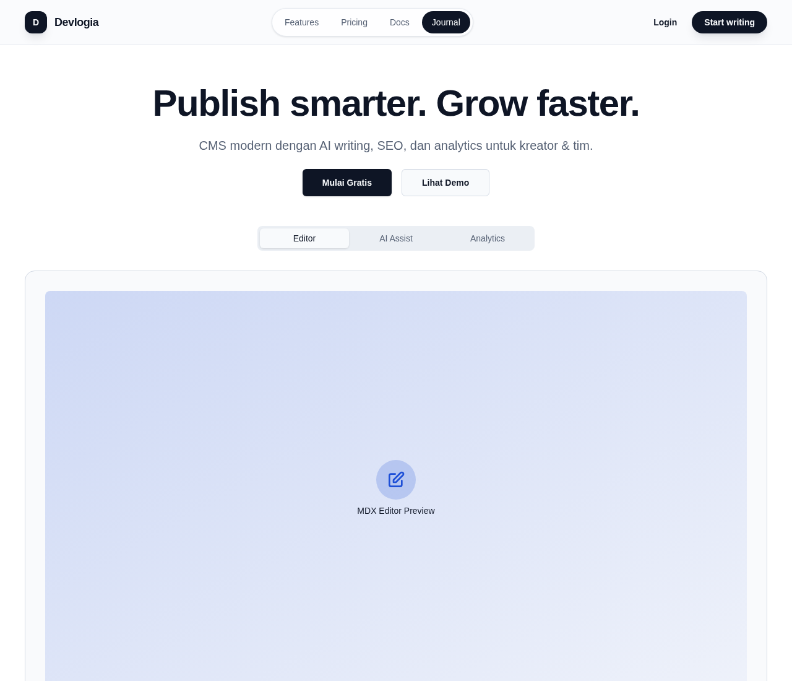
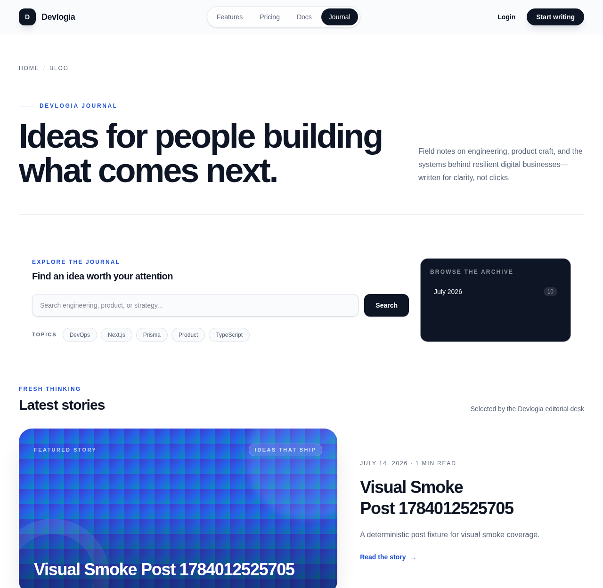
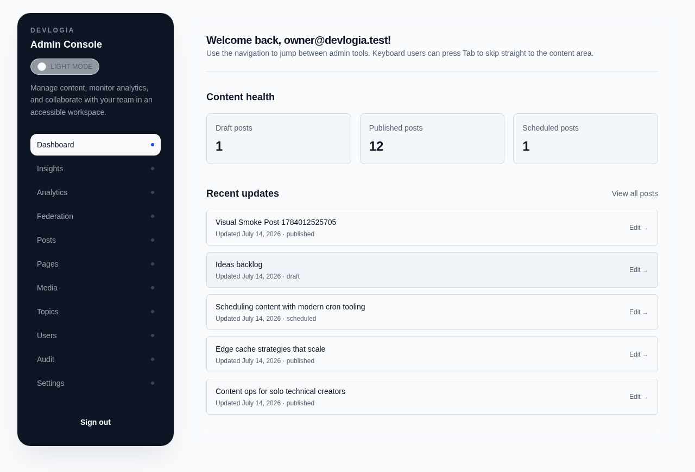
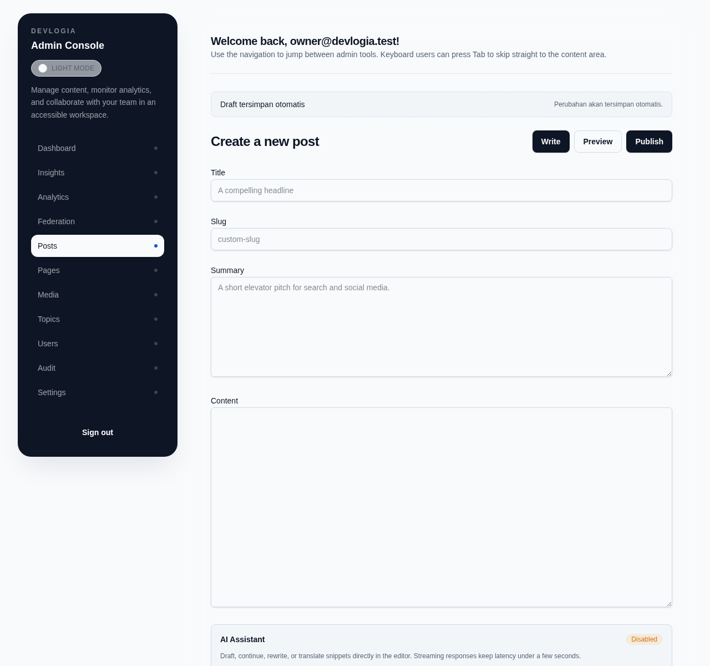
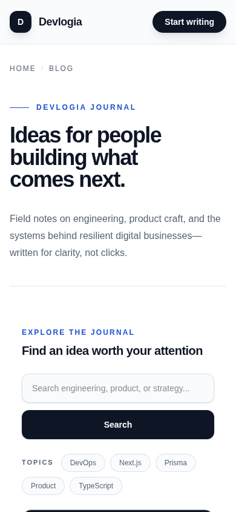

# Devlogia — Personal Blog CMS

> Where logic meets narrative. Devlogia is a Next.js publishing workspace for writing, managing, and presenting technical content.



## Application preview

| Public journal                                                                  | Admin dashboard                                                                                        |
| ------------------------------------------------------------------------------- | ------------------------------------------------------------------------------------------------------ |
| [](docs/assets/preview/blog.png) | [](docs/assets/preview/admin-dashboard.png) |

| MDX editor                                                                      | Mobile journal                                                                                |
| ------------------------------------------------------------------------------- | --------------------------------------------------------------------------------------------- |
| [](docs/assets/preview/editor.png) | [](docs/assets/preview/blog-mobile.png) |

The curated screenshots were captured with Playwright against the seeded production build on 14 July 2026. The separate `tests/e2e/visual-smoke.spec.ts` run writes 19 full-page desktop/mobile captures to `test-results/visual-smoke-*`; the selected production captures above live in `docs/assets/preview/` so they remain available outside Playwright artifacts.

## Release scope

The production release scope is the CMS/blog experience:

- Public landing page, journal, search, tags, archive, post detail, static pages, and newsletter page.
- **Automated Multi-Language MDX Translation**: Pipeline preserving code snippets and MDX tags while auto-translating posts into Indonesian, Spanish, French, German, Japanese, Chinese, and English (`/api/ai/translate` & `/api/posts/translate`).
- **Text-to-Speech (TTS) Audio Article Player**: Clean narration prose extraction, estimated reading duration, chapter generation, and glassmorphic Web Speech API player with playback speed controls (`0.75x`–`2.0x`) and animated audio waves (`/api/tts` & `<AudioArticlePlayer />`).
- **Editorial Approval Pipeline**: Structured multi-tier editorial approval workflow (`DRAFT` → `IN_REVIEW` → `CHANGES_REQUESTED` → `APPROVED` → `PUBLISHED` / `SCHEDULED`) with review queue dashboard (`/admin/reviews` & `/api/admin/posts/[id]/review`).
- **API Key & Access Token Manager**: Environment API key loading (`DEVPORTAL_SANDBOX_API_KEY`, `FEDERATION_API_KEY`, `DEVLOGIA_SDK_TOKEN`, `API_KEYS`), cryptographically secure scoped token issuance (`devlogia_sk_...`), scope validation, and Admin Console UI (`/admin/api-keys` & `/api/admin/api-keys`).
- Admin authentication, dashboard, RBAC, posts, pages, revisions, scheduled publishing, media, users, audit log, settings, and analytics.
- MDX editing with autosave, local recovery, preview, AI-assist controls, cover media, and tags.
- RSS, sitemap, Open Graph images, structured data, health/readiness endpoints, rate limiting, telemetry, and webhook revalidation.
- OpenAPI output and a beta developer portal/SDK foundation.

Tenant workspaces, marketplace/billing, plugins/extensions, federation, recommendations, and the developer ecosystem have routes and foundation code, but are still beta. Their Prisma models are not all covered by checked-in migrations; keep those modules out of a production rollout until their migrations and targeted E2E flows are complete.

## Stack

| Layer   | Implementation                                          |
| ------- | ------------------------------------------------------- |
| Web     | Next.js 16 App Router, React 19, Tailwind CSS 4         |
| Data    | Prisma 6.18, MySQL 8                                    |
| Auth    | NextAuth 4 credentials provider with JWT sessions & Scoped API Keys |
| Content | MDX through `next-mdx-remote`, remark, and rehype       |
| Audio   | Web Speech API & TTS cleaner narration engine           |
| Media   | Supabase Storage with a local `public/uploads` fallback |
| Tests   | Vitest, Testing Library, and Playwright                 |
| API     | App Router route handlers and generated OpenAPI         |

## Quick start

Requirements: Node.js 20+, pnpm 8+, Docker with Compose, and a Playwright-compatible browser for E2E tests.

```bash
pnpm install
cp .env.example .env
pnpm db:up
pnpm db:reset
pnpm dev
```

Open:

- Public site: <http://localhost:3000>
- Journal: <http://localhost:3000/blog>
- Admin login: <http://localhost:3000/admin/login>
- Editorial Review Queue: <http://localhost:3000/admin/reviews>
- API Keys & Access Tokens: <http://localhost:3000/admin/api-keys>
- Developer portal (beta): <http://localhost:3000/developers>

The deterministic seed creates these local accounts:

| Role                | Email                       | Password         |
| ------------------- | --------------------------- | ---------------- |
| Superadmin          | `owner@devlogia.test`       | `owner123`       |
| Admin               | `admin@devlogia.test`       | `admin123`       |
| Editor              | `editor@devlogia.test`      | `editor123`      |
| Writer              | `writer@devlogia.test`      | `writer123`      |
| Tenant admin (beta) | `tenantadmin@devlogia.test` | `tenantadmin123` |
| Viewer (beta)       | `viewer@devlogia.test`      | `viewer123`      |

Change all seeded credentials outside local/test environments.

## Project layout

```text
devlogia/
├── docs/                 Runbooks, release notes, audits, and preview assets
├── packages/sdk/         Beta TypeScript SDK source and build output
├── prisma/               MySQL schema, migrations, and deterministic seed
├── public/               Static assets and local upload fallback
├── scripts/              Database, deploy, reporting, and maintenance commands
├── src/app/              App Router pages and API route handlers
├── src/components/       Public, admin, editor, and developer-portal UI
├── src/lib/              Auth, CMS, security, AI translation, TTS, telemetry, and domain helpers
├── tests/e2e/            Playwright browser tests
└── openapi.yaml          Generated API schema
```

See [docs/README.md](docs/README.md) for the documentation map, ownership, and historical-document policy.

## Main routes

Public routes:

- `/`, `/blog`, `/blog/[slug]`, `/blog/tags/[slug]`, `/blog/archive/[year]/[month]`
- `/[slug]` for published static pages, `/subscribe`, and tokenized post previews
- `/developers`, `/developers/docs/[...slug]`, `/developers/playground`, `/developers/submissions`, and `/developers/webhooks/tester` (beta)

Admin routes:

- `/admin/dashboard`, `/admin/posts`, `/admin/reviews`, `/admin/api-keys`, `/admin/pages`, `/admin/media`, `/admin/users`, and `/admin/audit`
- `/admin/analytics`, `/admin/insights`, `/admin/topics`, and `/admin/settings`
- `/admin/workspaces`, `/admin/federation`, `/admin/marketplace/revenue`, and `/admin/ai/extensions` (beta)

Operational/API routes:

- `/api/ai/translate` & `/api/posts/translate` perform multi-language MDX translation while keeping code blocks & tags intact.
- `/api/tts` extracts clean audio narration prose, estimated duration, and chapter breakdown for articles.
- `/api/admin/posts/[id]/review` & `/api/admin/reviews` manage the editorial review queue pipeline.
- `/api/admin/api-keys` & `/api/admin/api-keys/[id]` list, issue, and revoke scoped API keys and access tokens.
- `/api/health` reports component status, latency, version, schema state, and rate-limit diagnostics.
- `/api/ready` returns `503` during maintenance, database failure, or pending migrations.
- `/api/docs` renders interactive Swagger UI for the checked-in schema.
- `/api/openapi.json` and `/api/docs/openapi.json` expose the generated OpenAPI document.
- `/api/rss`, `/api/sitemap`, and `/api/og` power discovery and social previews.

## Configuration

Use `.env.example` as the complete local reference, `.env.test` for deterministic tests, and `.env.production.example` as the deployment checklist. Important groups are:

- Core: `DATABASE_URL`, `NEXTAUTH_URL`, `NEXTAUTH_SECRET`, `NEXT_PUBLIC_APP_URL`.
- Storage: `SUPABASE_URL`, `SUPABASE_SECRET_KEY`, `SUPABASE_STORAGE_BUCKET`.
- AI: `AI_PROVIDER`, model variables, provider keys, and rate-limit/TTL settings.
- Operations: `MAINTENANCE_MODE`, `RATE_LIMIT_REDIS_URL`, `SENTRY_*`, `LOGTAIL_TOKEN`, and CSP reporting.
- Optional/beta: analytics, newsletter, tenant, billing, federation, SDK, and developer-portal variables.

`AUTH_SECRET` is accepted as a compatibility override by NextAuth middleware, but `NEXTAUTH_SECRET` is the canonical key in the checked-in environment templates and is also required by CMS preview tokens.

When `DATABASE_URL` is absent, build-time read helpers return empty results so static/documentation builds can complete. Runtime mutations and database-backed pages still need MySQL.

## Common commands

| Command                              | Purpose                                                                   |
| ------------------------------------ | ------------------------------------------------------------------------- |
| `pnpm dev`                           | Start the Next.js development server                                      |
| `pnpm build` / `pnpm start`          | Build and serve production output                                         |
| `pnpm lint`                          | Run ESLint with zero warnings allowed                                     |
| `pnpm typecheck`                     | Run TypeScript without emitting files                                     |
| `pnpm test` / `pnpm test:watch`      | Run Vitest once or in watch mode                                          |
| `pnpm test:e2e`                      | Run Playwright; the configured dev server starts automatically            |
| `pnpm test:e2e:full`                 | Start MySQL, reset/seed the test DB, then run all Playwright specs        |
| `pnpm db:up` / `pnpm db:down`        | Start or stop Docker Compose services                                     |
| `pnpm db:reset`                      | Reset the configured database with migrations and deterministic seed data |
| `pnpm db:backup` / `pnpm db:restore` | Create or restore a MySQL logical backup                                  |
| `pnpm openapi:generate`              | Regenerate `openapi.yaml` after API changes                               |
| `pnpm openapi:validate`              | Validate the checked-in OpenAPI schema                                    |
| `pnpm sdk:build`                     | Build the beta SDK into `packages/sdk/dist`                               |
| `pnpm posts:publish-scheduled`       | Publish due scheduled posts idempotently                                  |

`package.json` is the canonical inventory for analytics, AI, billing, federation, tenant, deployment, and developer-portal scripts.

## Quality gates

Run the complete engineering gate before release:

```bash
pnpm lint
pnpm typecheck
pnpm test
pnpm build
pnpm test:e2e:full
```

Last local documentation audit (14 July 2026):

- `pnpm lint` — passed; it prints a non-blocking stale `baseline-browser-mapping` data notice.
- `pnpm typecheck` — passed.
- `pnpm test` — passed, 44 files / 133 tests.
- `pnpm build` — passed with documented non-blocking build warnings.
- Visual Playwright smoke — passed, 1/1 scenario with 19 screenshots.

The full Playwright suite should still be run for the target release environment. Visual artifacts are test output, not a substitute for functional E2E coverage.

## CMS workflow

- Posts support `DRAFT`, `SCHEDULED`, and `PUBLISHED` states plus cursor pagination and filters.
- Successful post/page writes create revision snapshots; the admin UI can restore prior revisions.
- `pnpm posts:publish-scheduled` publishes due posts and records scheduled-worker audit metadata.
- Writers remain draft-only; higher roles receive publish/schedule capabilities according to RBAC.
- Media uses Supabase in configured deployments and local files during offline/CI flows.
- AI editor controls remain disabled when no provider is configured.

## OpenAPI and SDK

After changing public route schemas:

```bash
pnpm openapi:generate
pnpm openapi:validate
```

The checked-in beta SDK exports `DevlogiaSDK` with `feed`, `insights`, `federation`, `auth`, and `ai` modules. Build it locally with `pnpm sdk:build`. Treat SDK methods that target beta platform routes as preview APIs and verify their corresponding route exists in the deployment before integrating.

## Operations and security

- Deployment: [docs/DEPLOYMENT.md](docs/DEPLOYMENT.md)
- Operations: [docs/OPERATIONS.md](docs/OPERATIONS.md)
- Backup and restore: [docs/BACKUP_RESTORE.md](docs/BACKUP_RESTORE.md)
- Security: [SECURITY.md](SECURITY.md)
- Authentication troubleshooting: [docs/AUTH_TROUBLESHOOTING.md](docs/AUTH_TROUBLESHOOTING.md)

Never commit real secrets or production seed credentials. Rotate `NEXTAUTH_SECRET` deliberately because doing so invalidates active JWT sessions and CMS preview tokens.

## License

MIT © 2025–2026 Devlogia contributors.
